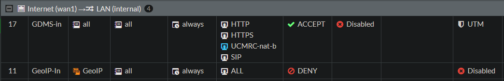

# proposal of a filter rule using GS Wave (GDMS UCMRC)

This article describes how to set up filter rules with GDMS, UCMRC, and CloudUCM. These rules apply to security appliances such as firewalls that interact with STUN servers when using UC, such as GS Wave communication, UCM-GDMS communication, telephone and proxy servers, and UCM endpoint communication.

## Description

The necessary services and ports are identified to provide a rule set using on security appliances, when GeoIP or other country-managed geographical indications prevent global accessibility.

## Configuration

Instructions on how to configure and set up the filter rule.

Here on a FortiGate, go to Policy & Objects -> Services -> Create New.

Enter a name, for example: UCMRC-nat-b, and add the UDP and TCP ports as shown next.


Alternatively, you can also insert the custom service ports out from the CLI, the commands can be found in the file service.txt. Verify the action with the following command:

```show firewall service custom "UCMRC-nat-b"```

Next, go to IPv4 Policy and right-click, then select from the context -> Insert Empty Policy -> Above. This policy must be before the GeoIP blocking policy, you can also move up and down later.

Edit the policy as shown in the image.


The new policy should look something like this in the policy overview.


Finaly, create an identical policy in reverse order from WAN to LAN with the same services, this rule must also be placed before the GeoIP blocking rule.



## Usage

Use your GS Wave App and call a participant and try to invite participants to conferences, making sure that the audio sound transmission is passed for/to all participants and that everyone can understand each other.

## Addendum

If they wish to further narrow it down, the addresses of origin from the voip-whitelist.txt can be used for the rule. This allows the addresses extracted from the [list](https://www.gdms.cloud/server/info/index.html/iplist.json) to be used as an address object in the policy.

To do this, go to Security Fabric -> Fabric Connector - Create New. A page with round icons will open, select IP Address, enter a name, and in the "URI of external resource" field, enter the RAW URL to voip-whitelist.txt. Then add the newly created connector as a Source/Destination in the policy.

When using the Grandstream UCM6300 Ecosystem and its endpoints like Wave, log in to the UCM as a super administrator and go to the RemoteConnect option (you need a UCMRC service plan). Under the "My Plan" tab, you will find the STUN Address, containing the server domain, for example, nat-x.gdms.cloud.

This address corresponds to the list published by GS, including IP addresses, domains, protocols, and ports [here](https://www.gdms.cloud/server/info/index.html/#/).

## Cause

Peer Blocking:

After your device obtains its public IP address via the STUN server, it attempts to send and receive data packets directly to and from the peer.

Even if your device sends the first packet (hole punching), many firewalls with GeoIP filters block the peer's response at the WAN interface if the peer's IP address originates from a restricted country.

In this case, the data packet (e.g., the audio signal during a phone call) never reaches your LAN device, even though the connection should technically be established.

Stateful Inspection vs. GeoIP:

Modern firewalls are stateful, meaning they automatically allow responses to outgoing requests.

The problem: GeoIP filters often intervene before the connection status has been checked. If a GeoIP rule states "Block everything from country X", the packet from the remote end is often immediately discarded, even before the firewall recognizes that your LAN device actually requested this packet.

## Contributing

Everyone is free to use and distribute this post without restriction; however, all use is at your own risk, and any liability is excluded.

## Disclaimer

The author assumes no liability for the accuracy, completeness, or timeliness of the information provided.

Liability claims against the author for damages of a material or immaterial nature arising from access to or use or non-use of the published information, from misuse of the connection, or from technical malfunctions are excluded.

## License

unblog/voip-whitelist is licensed under the MIT License ```MIT```.