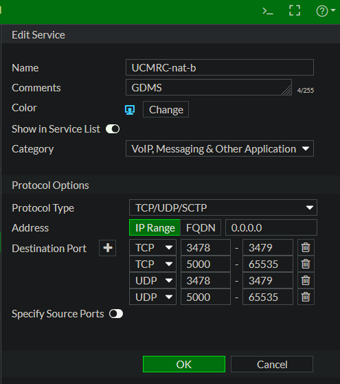
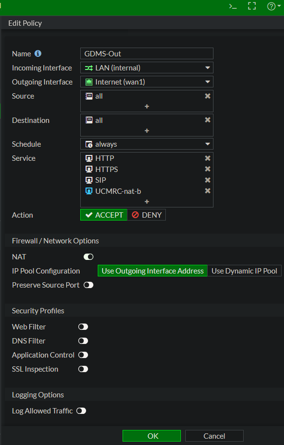
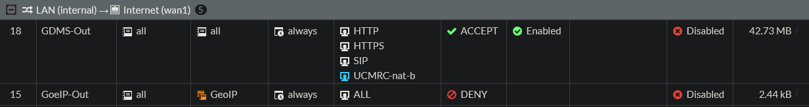

# proposal of a firewall rule using GDMS & UCMRC & CloudUCM

This article describes the configuration of a firewall filter rule using GDMS and UCMRC, Wave communication, UCM-GDMS communication, phone and proxy server, UCM-endpoint communication.

## Description

The necessary services and ports are identified to provide a rule on the WAN interface, especially when GeoIP and similar country-managed geographical address ranges control and limit global reachability.

## Configuration

Instructions on how to configure and set up the filter rule.

Here on a FortiGate, go to Policy & Objects -> Services -> Create New
Enter a name, for example: UCMRC-nat-b, and add the UDP and TCP ports as shown.

Next, go to IPv4 Policy and right-click, then select from the context menu -> Insert Empty Policy -> Above (This rule must be before the GeoIP blocking rule). Edit the policy as shown in the image.

The new policy should look something like this in the policy overview.

## Usage

Use your Wave App and call a participant and try to invite participants to conferences, making sure that the audio sound transmission is successful for all participants and that everyone can understand each other.

## Contributing

Everyone is free to use and distribute this post without restriction; however, all use is at your own risk, and any liability is excluded.

## License

unblog/voip-whitelist is licensed under the GNU General Public License v3.0.